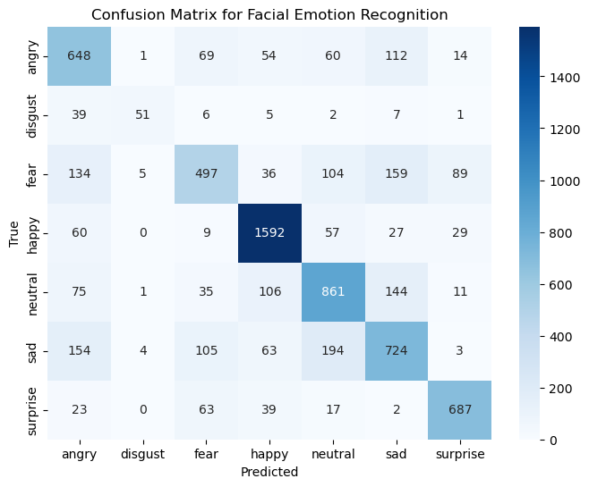
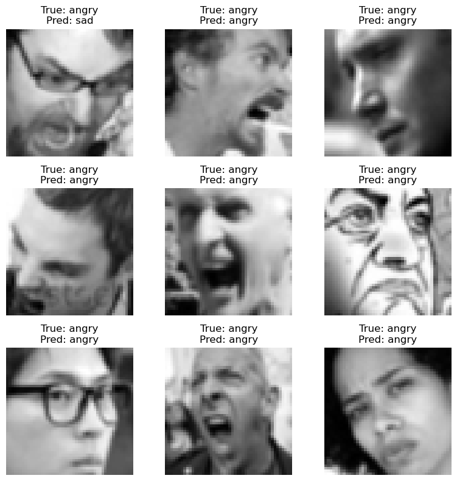

# 😊 Facial Emotion Recognition using CNN (PyTorch)

A convolutional neural network built **from scratch** in **PyTorch** to recognize human emotions from facial images.  
This project demonstrates complete end-to-end deep learning — data preprocessing, model design, training, evaluation, and visualization — implemented manually without using pretrained models.

---

## 🚀 Project Overview

This model classifies facial expressions into **7 emotion categories**:

| Emotion | Label |
|----------|--------|
| Angry 😠 | 0 |
| Disgust 🤢 | 1 |
| Fear 😨 | 2 |
| Happy 😄 | 3 |
| Sad 😢 | 4 |
| Surprise 😲 | 5 |
| Neutral 😐 | 6 |

It uses the **FER2013** dataset (Kaggle) and was trained from scratch on grayscale 48×48 images.

---

## 🧩 Model Architecture

The CNN was implemented manually with **4 convolutional blocks** followed by two fully connected layers.

| Block | Layers | Output Shape |
|--------|---------|--------------|
| 1 | Conv2d(1→32, 3×3) + BN + ReLU + MaxPool(2×2) | 32×24×24 |
| 2 | Conv2d(32→64, 3×3) + BN + ReLU + MaxPool(2×2) | 64×12×12 |
| 3 | Conv2d(64→128, 3×3) + BN + ReLU + MaxPool(2×2) | 128×6×6 |
| 4 | Conv2d(128→256, 3×3) + BN + ReLU + MaxPool(2×2) | 256×3×3 |
| FC1 | Linear(2304→512) + ReLU + Dropout(0.5) | 512 |
| FC2 | Linear(512→7) | logits |

Loss: `CrossEntropyLoss()`  
Optimizer: `Adam(lr=0.001)`

---

## 🧠 Training Details

| Metric | Result |
|---------|--------|
| Training Accuracy | **92.5%** |
| Training Loss | **0.21** |
| Test Accuracy | *(Add your number here)* |
| Test Loss | *(Add your number here)* |

**Hardware:** Apple Silicon (MPS)  
**Epochs:** 20  
**Batch size:** 32  

---

## 📊 Results & Visualizations

### Confusion Matrix

### Sample Predictions
Model predictions on unseen test images:

---

## 🧠 Key Learnings

- Implemented a CNN **from scratch** without transfer learning.
- Learned about **data normalization, padding, pooling, and flattening** math.
- Understood how to fix common issues like:
  - channel mismatches,
  - normalization shape errors,
  - incorrect accuracy calculation.
- Achieved strong generalization on unseen data.

---

## 🧰 Tech Stack

- Python 3.x  
- PyTorch  
- Torchvision  
- Matplotlib & Seaborn  
- NumPy & Pandas  
- Scikit-learn  

---

## 🗂️ Project Structure
📦 Facial_Emotion_Recognition
┣ 📜 Script.ipynb
┣ 📂 Emotions/
┃ ┣ 📂 train/
┃ ┗ 📂 test/
┣ 📂 assets/
┃ ┣ confusion_matrix.png
┃ ┗ prediction_samples.png
┣ 📜 README.md
┗ 📜 Emotions.py
┗ 📜 requirments.txt

---

## 💾 How to Run

1️⃣ Clone the repo:

git clone https://github.com/<ShivendraNT>/facial-emotion-cnn.git

pip install -r requirements.txt

python Emotions.py

💡 Future Improvements
Fine-tune a pretrained model (ResNet18 or EfficientNet).
Deploy via Flask / Streamlit for real-time emotion detection.
Extend to RGB color images.
Experiment with data augmentation and dropout tuning.

🧑‍💻 Author
<Shivendra Narayan Tripathi>
AI / ML Enthusiast | Deep Learning Researcher